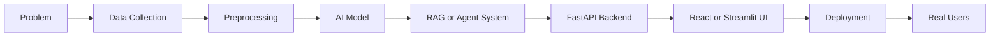

<div align="center">


<br>


</div>

---

# 👨‍💻 About Me

```yaml
Name: Sudhit Rajwar
Education: B.Tech Engineering Physics @ DTU
Role: AI Engineer
Focus:
  - Generative AI
  - Retrieval-Augmented Generation (RAG)
  - Multi-Agent Systems
  - Computer Vision
  - AI System Design

Current Goal:
  Building production-grade AI products that solve real-world problems.
```

---

## 🚀 What I Build

🧠 LLM Applications

🔎 RAG Pipelines

🤖 Multi-Agent Systems

👁️ Computer Vision Systems

⚡ FastAPI Backends

🎨 React Frontends

☁️ Deployable AI Products

---

# 🔥 Featured Projects

## 🏥 Healthcare Knowledge Navigator

Evidence-based Healthcare QA platform powered by:

- FastAPI
- LangChain
- Qdrant
- BM25
- LLMs
- Streamlit

### Key Features

✅ Hybrid Retrieval

✅ Clinical Guideline Search

✅ Query Classification

✅ Grounded Responses

✅ FastAPI API Layer

---

## 💰 Multi-Agent Financial Intelligence System

AI-powered financial analysis platform.

### Features

- Multi-Agent Workflows
- Anomaly Detection
- LLM Reasoning
- Explainable Recommendations
- Interactive Dashboard

### Tech

LangGraph • LLMs • Streamlit • Python

---

## 👁️ AI Surveillance Platform

Real-Time Intelligent Monitoring System

### Features

- Crowd Counting
- Person Tracking
- Intrusion Detection
- Restricted Zone Alerts
- Heatmaps
- Violence Detection

### Tech

YOLO • OpenCV • DeepSORT • PyTorch

---

## 🌍 AI Climate Digital Twin

Advanced climate intelligence platform.

### Features

- Climate Forecasting
- What-If Simulator
- AI Climate Copilot
- Policy Optimization
- Disaster Prediction

---

# 🛠 Tech Stack

## Languages

<p>

</p>

## AI / ML

<p>

</p>

- Scikit-Learn
- XGBoost
- Hugging Face
- Transformers
- LangChain
- LangGraph
- FAISS
- Qdrant

---

## Backend

<p>

</p>

---

## Frontend

<p>

</p>

---

## Databases & Tools

<p>

</p>

---

# 📈 GitHub Analytics

<div align="center">


</div>

---

<div align="center">


</div>

---

# 🧠 Current Learning Roadmap

```text
AI Engineering        ████████████████████ 100%

GenAI Systems         ███████████████████░ 95%

RAG Pipelines         ███████████████████░ 95%

Computer Vision       █████████████████░░░ 85%

FastAPI               █████████████████░░░ 85%

React                 ██████████████░░░░░░ 70%

Docker                ██████████████░░░░░░ 70%

Kubernetes            ████████░░░░░░░░░░░░ 40%
```

---

# ⚙️ AI Engineering Workflow



---

# 🏆 Achievements

🥇 Building End-to-End AI Systems

🚀 Production-Ready FastAPI Projects

🧠 RAG & Multi-Agent Development

👁️ Computer Vision Applications

📚 Continuous Learning in AI Engineering

---

# 🌐 Connect With Me

<div align="center">

<a href="https://www.linkedin.com">

</a>

<a href="https://github.com/sudhitrajwar">

</a>

</div>

---

# 🐍 Contribution Snake

> Enable GitHub Actions later to generate this automatically.

```yaml
.github/workflows/snake.yml
```

Then add:

```html
<p align="center">
  
</p>
```

---

<div align="center">

### ⭐ Building AI Systems, Not Just Models ⭐


</div>
